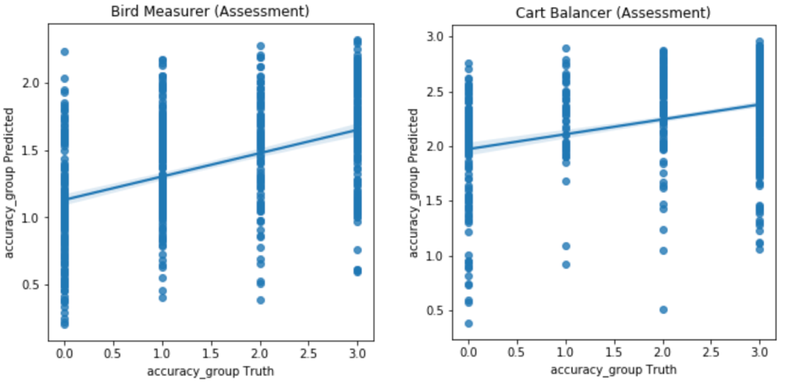

# Kaggle 2019 Data Science Bowl (DSB)

## 1. Introduction

## 2. Understand the data

## 3. Feature engineering

Prediction based on previous assessments
Prediction based on other game sessions.
Different distribution in th train set and test set.

## 4. Model

### 4.1 Classification v.s. Regression

This problem looks like a classification problem (since the task is to classify the users into Group 0 to Group 3). However, since the 4 Groups correspond to users' performance (e.g. Group 0 represents worst performance, Group 3 represents best perfomance), I first thought of using **regression approach with thresholds**. Actually, this is also the approach most of the winning teams applied.

#### Regression with thresholds (OptimizedRounder)
Now we **use the regression approach to solve the 'classification' problem**. Compared with normal regression problem, we only need to add one more step: find out the optimized thresholds (boundaries) between classes. Therefore, now we need to do:
- Step 1: build feature
- Step 2: fit a regression model
- **Step 3: find the optimal thresholds**

If you skip Step 3 and just use the following thresholds, you may get really bad results, because the thresholds in the table are not optimized.

|  Regression output | Group determined  | 
|:----------:|:-----:|
| (-inf, 0.5) |   0   |
| [0.5, 1.5)  |   1   |
| [1.5, 2.5)  |   2   |
| [2.5, +inf) |   3   |

The OptimizedRounder was first written by Abhishek Thakur: 
https://www.kaggle.com/c/petfinder-adoption-prediction/discussion/76107 
and later improved: 
https://www.kaggle.com/naveenasaithambi/optimizedrounder-improved (the improvement is is speed).
The idea has also been used in previous Kaggle competitions:
https://www.kaggle.com/artgor/quick-and-dirty-regression

### 4.2 Different assessment types share the same thresholds?

Here is a trick!

At first, I thought it's absurd to find a same set of thresholds that *all assessments share*. Because for different assessment types, the distribution of the regression output is quite different. For example, the figure below shows the regression output for two types of Assessments: 'Bird Measurer' and 'Cart Balancer'.

The optimized thresholds for each assessment type are:

- Bird Measurer (Assessment): 
     Optimized thresholds: [1.00, 1.40, 1.77]
     Optimized QWK_score: 0.457
- Cart Balancer (Assessment)
    Optimized thresholds: [1.72, 2.12, 2.35]
    Optimized QWK_score: 0.390

If using the same thresholds for both types, the QWK_score of each type would be much poorer!

For this reason, I did the thresholds searching for the 5 assessment types one by one at the begining. 

**However, as opposed to my opinion, shared thresholds turn out to be better!**  Why? Although type-dependent thresholds can optimize the QWK_score for each individual assessment type, the overall QWK_score is lower! **In other word, better QWK_scores for each partition of the data doesn't guarantee a better QWK_score for the whole data!** (If you think twice, this make sense. Just think about an extreme case, where you put all class 0 in partition 0, put all class 1 in partition 1, .... Then, even you make a perfect prediction, for each partition the QWK_score is only 0.)

The table below is an example. It shows the thresholds and the QWK_score from three searches. If we look at each individual assessment type, the 'Shared Thresholds' gives the worst score. However, if we put all types together, the 'Shared Thresholds' gives the best QWK_score! Surprising!!!

| Assessment type |  Shared Thresholds |  Separate Thresholds 1  | Separate Thresholds 2   (finer search)  | 
|:----------:|:----------:|:-----:|:-----:|
|Bird Measurer    | [0.97, 1.58, 2.28]   score: 0.370 | [1.17, 1.39, 3.23]   score: 0.398 | [1.00, 1.40, 1.85]    score: 0.454  |
|Cart Balancer    | [0.97, 1.58, 2.28]   score: 0.314 | [1.12, 2.16, 2.23]   score: 0.382 | [1.64, 2.11, 2.24]    score: 0.400  |
|Cauldron Filler  | [0.97, 1.58, 2.28]   score: 0.267 | [1.15, 2.17, 2.34]   score: 0.334 | [1.89, 2.09, 2.34]    score: 0.352  |
|Chest Sorter     | [0.97, 1.58, 2.28]   score: 0.375 | [0.75, 0.96, 3.79]   score: 0.435 | [0.67, 0.95, 1.80]    score: 0.470  |
|Mushroom Sorter  | [0.97, 1.58, 2.28]   score: 0.271 | [1.09, 2.28, 2.34]   score: 0.336 | [1.77, 2.28, 2.35]    score: 0.353  |
|**Overall QWK_score**|  **0.540**  |  **0.521** |   **0.515**  |

By using the shared threshold, my validation QWK_score increased from 0.530 to 0.540!

### 4.3 Regression on accuracy, or on accuracy_group

## 5. Data augmentation

DATA_AUGMENT = True  # if DATA_AUGMENT is True, include the labeled test data into train.
DATA_REUSE = True  
if DATA_REUSE is True, use all the rows in Xy_df 
    (one user can contribute to multiple train points if he did multiple assessments ); 
else, only take the rows where 'is_last_assessment' == 1
    (one user only contributes to one train point). 

